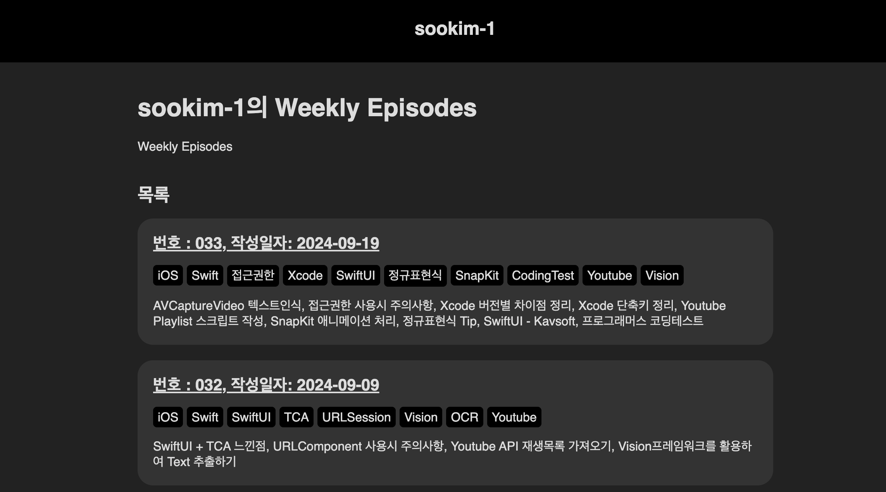

해당 저장소는 [ios-osushi's website](https://github.com/ios-osushi/website)를 참고하여 작성했습니다.
Swift 언어로 Static Website를 편리하게 작성하도록 도와주는 [Publish](https://github.com/JohnSundell/Publish)라이브러리를 사용했습니다.

개인용도로 매주 개발과 관련된 내용을 회고느낌으로 작성한 블로그배포 저장소입니다.

> 예시



- 실제 구현된 웹사이트를 확인 👉 [sookim-1 주간회고록](https://sookimblogoriginversion.vercel.app/)
- 자세한 개발 경험 확인 👉 [블로그사이트 개발 경험기](./docs/blog_development.md)

## 커스텀 방법

해당 저장소를 활용하여 개인 T.W.L 블로그를 구축할 수 있습니다.

1. 해당 저장소 를 fork 합니다.
2. `Content/posts` 폴더에 마크다운 문서를 추가합니다.
3. `Global.swift` 에서 변수들을 알맞는 값으로 변경합니다.
4. Xcode를 실행하여 Mac으로 빌드하면 Output 폴더가 생성됩니다. 해당 폴더를 github.io 저장소에 추가하면 호스팅이 완료됩니다.

> 게시글 마크다운 형식 예시

```markdown
---
date: 2024-01-01 23:00
description: 블로그 생성
tags: iOS, Swift
---
# 번호: 001, 작성일자: 2024-01-01
```

## 워크플로 실행 방법

### 깃허브 페이지 자동 배포 워크플로
1. [Content/posts](./Content/posts) 폴더에 마크다운문서를 추가합니다.
2. 추가한 후 main브랜치에 Merge되면 [build-and-deploy.yml](./.github/workflows/build-and-deploy.yml) 워크플로가 동작합니다.
3. 워크플로가 통과되면 userName.github.io 원격저장소에 배포됩니다.

### 문서 작성 워크플로
1. [create_post.yml](./.github/workflows/create_post.yml) 워크플로를 동작합니다.
2. 문서번호, 작성일자, 회고 시작일, 회고 종료일을 입력받아서 문서를 작성하여 PR이 진행됩니다.
3. 문서내용을 수정하여 PR을 Merge하면 위의 블로그 배포방법 순서로 배포됩니다.

