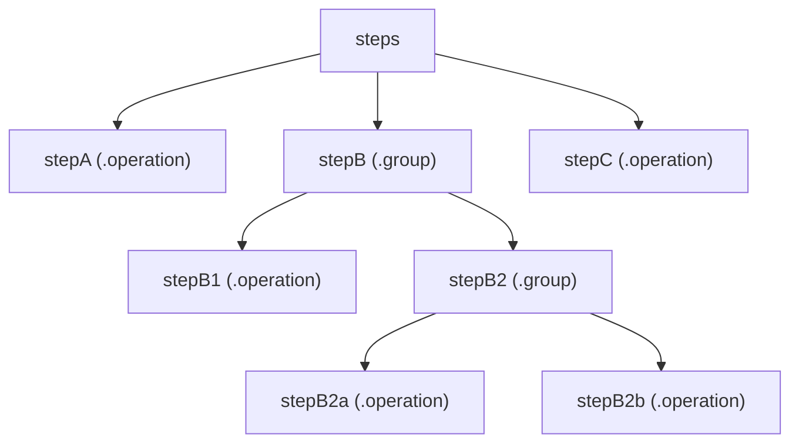

우연히 한 외국 iOS 블로그에서 T.W.L(This Week I Learned)이라는 이름으로, 매주 학습한 내용을 꾸준히 기록하는 것을 보고 멋지다는 생각이 들었습니다.
그래서, 저도 같은 방식으로 블로그를 만들어봐야겠다고 생각했습니다.
위에서 언급한 iOS 외국 블로그 작성자는 iOS Osushi 라는 일본 iOS 개발자 팀이였고 해당 [링크](https://ios-osushi.github.io/)로 이동하면 둘러볼 수 있습니다.

해당 글에서는 제가 T.W.L 블로그를 구현한 방법에 대해 회고방식으로 설명하겠습니다.

### 구현방법

가장 먼저 [ios-osushi.github.io](https://github.com/ios-osushi/ios-osushi.github.io) 저장소로 이동하여 어떻게 구현되었는 지에 대해서 파악했습니다.

![./publish_deploy_capture.png]
커밋내역들을 살펴본 결과 대부분의 커밋메시지가 `deploy: ios-osushi/website` 로 website 라는 저장소에서 github.io 저장소로 배포한 것을 확인했습니다.

[website](https://github.com/ios-osushi/website) 저장소로 이동하여 README.md 문서를 봤습니다. 

```markdown
### 必要条件
- Xcode 15.3+ (Swift 5.10+)
- Python
- Make

...

`make run` を実行し、 [http://localhost:8000](http://localhost:8000/) へアクセスすると、プレビューが表示されます。

```


Make 빌드 도구를 사용하고 명령어를 실행한다고 명시되어있었습니다.
Makefile에서 프로젝트를 실행하는 run, generate 스크립트를 살펴보면 ./.build/release/publish-cli 에서 실행합니다. 

```
PUBLISH_CLI_PATH := ./.build/release/publish-cli

...

.PHONY: run
run:
	${PUBLISH_CLI_PATH} run

.PHONY: generate
generate:
	${PUBLISH_CLI_PATH} generate
```


그 후 `Package.swift`를 살펴보니 해당 웹사이트는 Swift를 사용하여 정적사이트를 만들 수 있는 [Publish](https://github.com/johnsundell/publish) 라이브러리를 사용한다는 것을 알 수 있었습니다.

README.md 문서를 다시보니 Content/posts 폴더에 Markdown 파일들을 추가한다고 명시되어 있어 보니 마크다운파일명들이 `{문서번호}-{작성일자}.md` 이로 규칙을 가지고 있었고, 마크다운 파일에 작성된 문서형식도 모두 같은 규칙을 가지고 있었습니다.

중간 요약을 하면 T.W.L을 문서형식에 맞춰 마크다운문서를 website 저장소의 Contents/posts/ 폴더에 추가하여 Swift를 사용한 정적사이트 빌드 라이브러리 Publish를 사용하였고 Make 도구로 빌드결과물을 github.io 저장소에 배포하여 블로그를 만든 구조라는 것을 파악했습니다

---
프로젝트 구조에 대해 파악을 진행했습니다.

```
Resources/
├── images/
│   └── favicon.svg
└── IosOsushiTheme/
    └── styles.css

Sources/
└── IosOsushiWebsite/
    ├── Extensions/
    │   └── String+URL.swift
    ├── main.swift
    └── Theme+IosOsushi.swift
```

각 파일들을 다음과 같이 유추했습니다.
- favicon.svg : 웹사이트의 favicon 파일
- styles.css :  CSS 파일
- String+URL.swift : String Extension에 URL 관련된 함수를 추가?
- main.swift : 진입점
- Theme+IosOsushi.swift : 웹사이트 테마 설정?

유추를 한 후 가장 먼저 진입점인 Sources의 main.swift를 확인했습니다.

```swift
// MARK: - main.swift
import Foundation
import Publish
import Plot

struct IosOsushiWebsite: Publish.Website {
    
    enum SectionID: String, WebsiteSectionID {
        case posts
    }

    struct ItemMetadata: WebsiteItemMetadata {}

    var url = URL(string: "https://ios-osushi.github.io")!
    var name = "iOS Osushi🍣"
    var description = "iOS関連のニュースを定期的に配信します。"
    var language: Language { .japanese }
    var imagePath: Path? { nil }
    var favicon: Favicon? { .init(path: "images/favicon.svg", type: "image/svg+xml") }
}

try IosOsushiWebsite().publish(using: [
    .addMarkdownFiles(),
    .copyResources(),
    .generateHTML(withTheme: .iosOsushi),
    .generateRSSFeed(including: [.posts]),
    .generateSiteMap(),
    .deploy(using: .gitHub("ios-osushi/ios-osushi.github.io", useSSH: false))
])
```

Swift로 작성되어 있어 쉽게 읽을 수 있었습니다.

Publish라이브러리를 임포트 -> IosOsushiWebsite 라는 구조체의 인스턴스를 생성 -> publish 메서드를 호출

IosOsushiWebsite가 채택한 Publish의 Website 프로토콜 구현 주석에는 각 프로퍼티들이 어떤 역할인지 자세히 확인할 수 있었습니다. 

요구 조건에 따라 저만의 웹사이트 이름, 설명, 언어, favicon 파일, URL 주소등으로 변경해주었습니다.
```swift
// MARK: - Website.swift
public protocol Website {
    /// The enum type used to represent the website's section IDs.
    associatedtype SectionID: WebsiteSectionID
    /// The type that defines any custom metadata for the website.
    associatedtype ItemMetadata: WebsiteItemMetadata

    /// The absolute URL that the website will be hosted at.
    var url: URL { get }
    /// The name of the website.
    var name: String { get }
    /// A description of the website.
    var description: String { get }
    /// The website's primary language.
    var language: Language { get }
    /// Any path to an image that represents the website.
    var imagePath: Path? { get }
    /// The website's favicon, if any.
    var favicon: Favicon? { get }
    /// The configuration to use when generating tag HTML for the website.
    /// If this is `nil`, then no tag HTML will be generated.
    var tagHTMLConfig: TagHTMLConfiguration? { get }
}
```


```swift
// MARK: - main.swift
...
try IosOsushiWebsite().publish(using: [
    .addMarkdownFiles(),
    .copyResources(),
    .generateHTML(withTheme: .iosOsushi),
    .generateRSSFeed(including: [.posts]),
    .generateSiteMap(),
    .deploy(using: .gitHub("ios-osushi/ios-osushi.github.io", useSSH: false))
])
```
publish 메서드의 using 파라미터에 인자로 동일한 타입의 여러 인스턴스가 배열형태로 전달되고 있습니다.
어떤식으로 구현되었는 지 간단히 살펴봤습니다.

```swift
// MARK: - Website.swift
@discardableResult
func publish(at path: Path? = nil,
			 using steps: [PublishingStep<Self>],
			 file: StaticString = #file) throws -> PublishedWebsite<Self> {
	let pipeline = PublishingPipeline(
		steps: steps,
		originFilePath: Path("\(file)")
	)

	let semaphore = DispatchSemaphore(value: 0)
	var result: Result<PublishedWebsite<Self>, Error>?
	let completionHandler = { result = $0 }
	
	Task {
		do {
			let website = try await pipeline.execute(for: self, at: path)
			completionHandler(.success(website))
		} catch {
			completionHandler(.failure(error))
		}
		
		semaphore.signal()
	}
	
	semaphore.wait()
	return try result!.get()
}
```
- discardableResult를 사용해서 결과값을 반환해도 오류가 발생하지 않았습니다.
- using 외부파라미터를 살펴보니 내부파라미터는 steps로 되어 있고 PublishingStep 타입들을 배열로 받고 있습니다.
- DispatchSemaphore를 사용하여 데이터 동시 접근을 제어하고 있습니다.
- 핵심 함수는 PublishingPipeline의 execute 이고 해당 함수를 확인해봤습니다.

```swift
// MARK: - PublishingPipeline.swift
extension PublishingPipeline {
    func execute(for site: Site, at path: Path?) async throws -> PublishedWebsite<Site> {
        let stepKind = resolveStepKind()

        let folders = try setUpFolders(
            withExplicitRootPath: path,
            shouldEmptyOutputFolder: stepKind == .generation
        )

        let steps = self.steps.flatMap { step in
            runnableSteps(ofKind: stepKind, from: step)
        }
	...
```

폴더를 만든 다음, steps를 재귀적으로 순회하여 RunnableStep라는 name, closure 프로퍼티를 가진 구조체를 하나의 배열로 반환 합니다.

step의 body 값이 operation이면 배열에 추가하고, group이면 내부의 동작들을 다시 확인하는 재귀 구조를 사용합니다.

해당 구현방식이 재밌어서 Mermaid 표로 작성해봤습니다.



`steps에 Input값이 [stepA(.operation), stepB(.group), stepC(.operation)]` 이 주어졌을 때 요소별로 runnableSteps를 호출 내부에서 operation이라면 RunnableStep 반환, group이라면 다시 runnableSteps 호출을 반복 후 flatMap

`Output값 : [runnableStepA, runnableStepB1, runnableStepB2a, runnableStepB2b, runnableStepC]`

---

간단하게 클로저들을 순서대로 실행한다는 내용을 살펴봤고 다시 인자들을 봤습니다.

다음으로 `iosOsushi`에서 사용된 `withTheme` 인자의 구현을 확인하기 위해 `Theme+IosOsushi.swift` 파일을 분석했습니다. 그리고 `Publish` 라이브러리가 제공하는 타입을 활용해 HTML의 헤더, 푸터, 링크 등을 제가 원하는 값으로 변경했습니다.


나머지 폴더인 .github/workflows, .husky 가 있었습니다.
husky는 깃 훅을 사용하기 쉽게 해주는 도구 인데 commit 전에 lint 검사를 하고 있습니다.

Github Action을 사용하는데 워크플로들을 보면 create_post.yml(post 게시물을 생성), ci.yml(빌드가 정상적인지 확인), deploy.yml(github.io 저장소에 배포하는 워크플로)들이 있습니다.

post 게시물을 생성하는 워크플로는 날짜를 입력하면 브랜치를 생성, 문서형식에 맞춘 마크다운 파일 추가, Pull Request 생성 단계인데 저는 날짜, 회고록 시작일, 회고록 종료일, 문서번호 4가지를 입력받도록 수정하고 문서형식도 수정했습니다. 
그 후 deploy.yml는 github.io 저장소에 배포해야 하므로 Github Action에 사용할 깃허브토큰을 발급받아 환경변수 설정을 완료했습니다.


### 느낀점

이러한 과정을 통해 저 만의 T.W.L 블로그를 만들어서 사용 중입니다. 

1. T.W.L을 작성하면 간단하게 배웠던 개념들을 다시 정리하면서 확실히 기억이 오래가는 것
2. 점점 문서가 쌓이면 그동안 작성한 것들이 아까워서 꾸준히 작성하게 되는 것
3. Swift로 정적웹사이트를 개발한 경험
4. 다른 개발자의 코드를 분석하고 목적에 맞게 커스텀한 경험

위의 경험들과 장점들을 느껴서 T.W.L 블로그 운영은 꾸준히 진행할 예정입니다.
